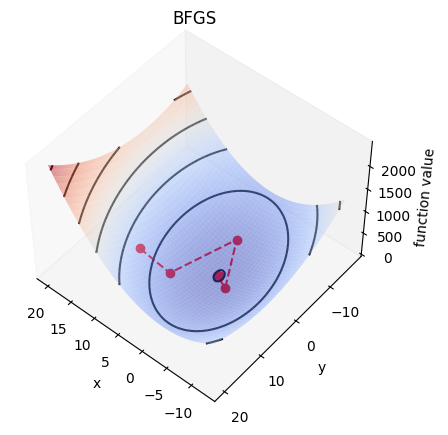
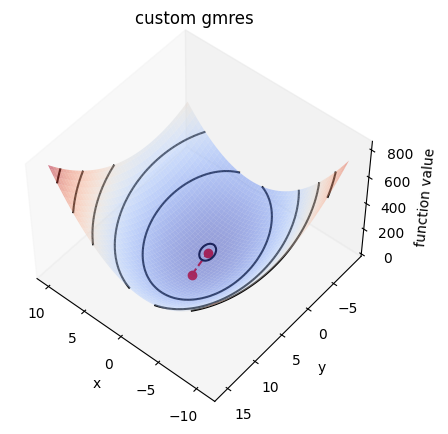
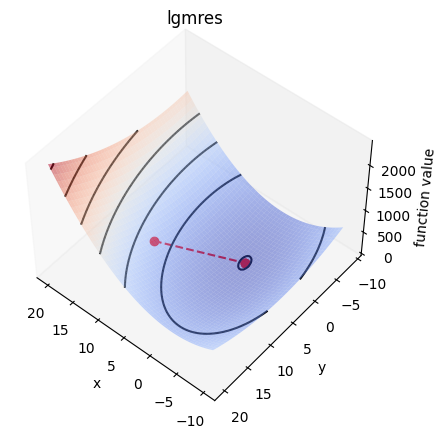
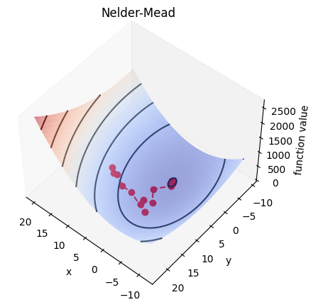

# Sp4e Assignments

## HW1

## Description
Repository containing the first assignment for MATH-611: Scientific Programming for Engineers. The goal of this exercise is to get familiar with scipy and numpy modules by implementing an iterative solver
and visualizing the results.

In the first exercise, scipy.optimize.minimize and scipy.sparse.linalg.lgmres routines are used to solve the minimization problem. In the second exercise, the generalized minimal residual method (GMRES) technique is implemented.

## Visuals
Results for the solution with three techniques of the same problem are presented below.

The solution to the quadratic surface function with different minimization methods is presented the below figures. These figures are obtained where A = ([8, 1] [1, 3]), b = ([2, 4]) with initial condition x0 = ([10, 10]). 
As seen from the presented figures LMGRES and GMRES methods converge to the solution with fewer steps than the other approaches. Although a comparison is possible between different methods over these figures, it could yield a different results once the system parameters or initial conditions are changed.

## Installation
External packages are used in this project as listed below:
- numpy v.1.23.4
- scipy v.1.9.2.
- matplotlib v.3.6.1

## Usage
### The HW1 directory contains the following files:
- exercise1.py contains the main function for the exercise1
- exercise2.py contains the main function for the exercise2
- optimizer.py contains the minimizers used in exercise 1 
- plotting.py contains plotting routines
- GMRES.py contains the GMRES method implementation 

Exercise1.py and exercise2.py are the main files for the exercises. All the arguments have to be manually set from inside these two files.

### Running the program
Exercise 1: Runs the given optimization problem with three different methods: lgmres, BFGS, and Nelder-Mead. Please change the metrices A, b, and initial condition x0 to run the optimization for other matrices.
Exercise 2: Runs the chosen optimizer with the given A matrix and vector.
Example usage:
>>> python exercise2.py --matrixdata_A  8 1 1 3 --nrows_A 2 --vectordata_b 2 4 --minimizer custom_gmres

To plot the results, simply append `--plot` to the command.
To save the results, append --export_path and specify the path where the figures will be saved.

To reproduce the figures, run the following commands:
>>> python exercise2.py --matrixdata_A  8 1 1 3 --nrows_A 2 --vectordata_b 2 4 --minimizer BFGS  --plot --export_path figures/BFGS.png 
>>> python exercise2.py --matrixdata_A  8 1 1 3 --nrows_A 2 --vectordata_b 2 4 --minimizer lgmres  --plot --export_path figures/lgmres.png 
>>> python exercise2.py --matrixdata_A  8 1 1 3 --nrows_A 2 --vectordata_b 2 4 --minimizer custom_gmres  --plot --export_path figures/custom_gmres.png 

## Authors
Pembe Gizem Özdil, Zeynep Özge Orhan